# Scube Task

# App Screen Shot

<p align="center">
  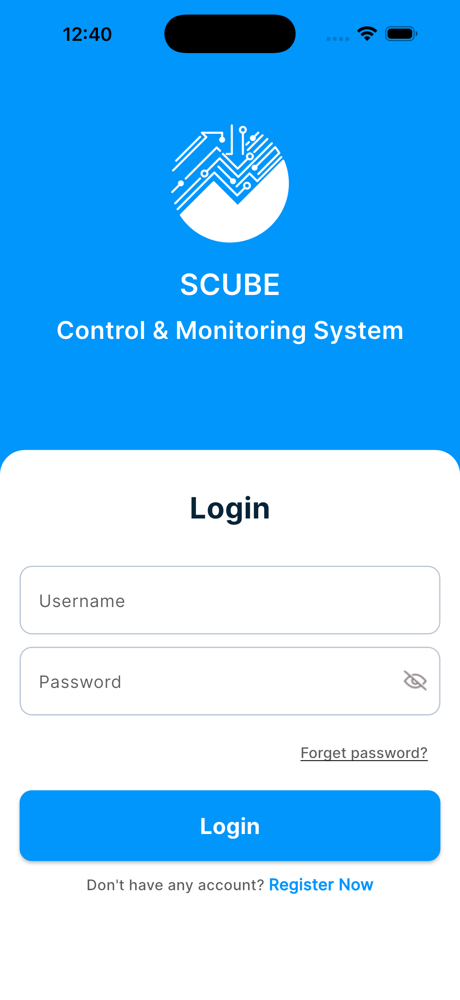
  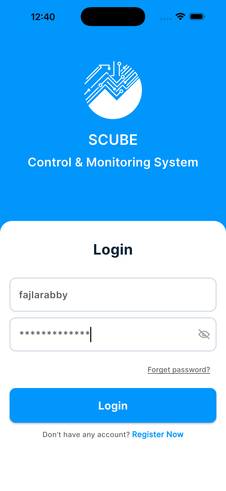
  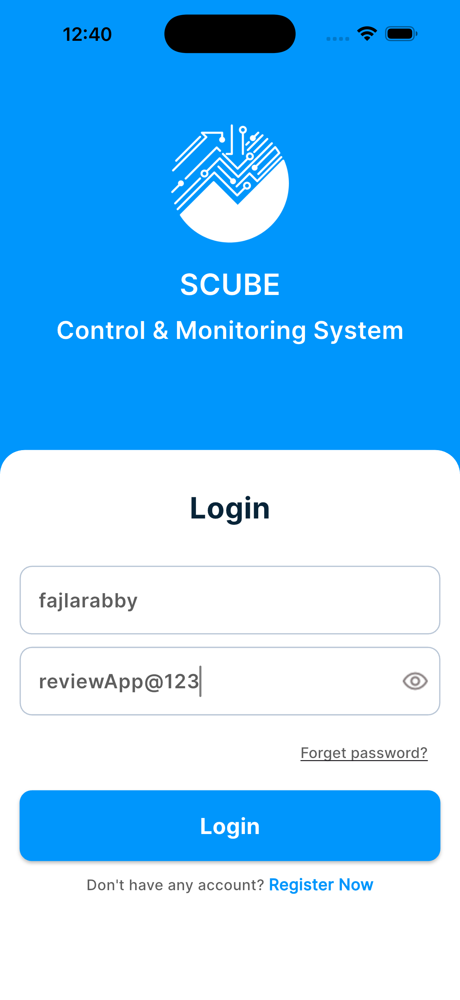
</p>

<p align="center">
  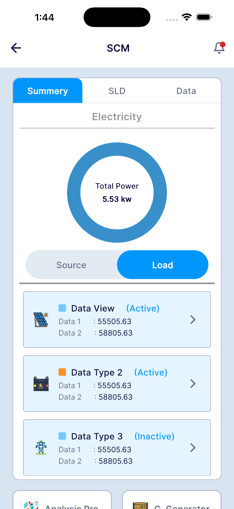
  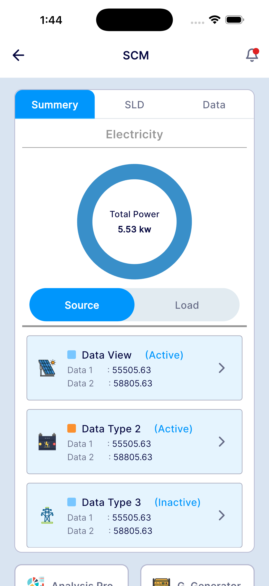
  
</p>

<p align="center">
  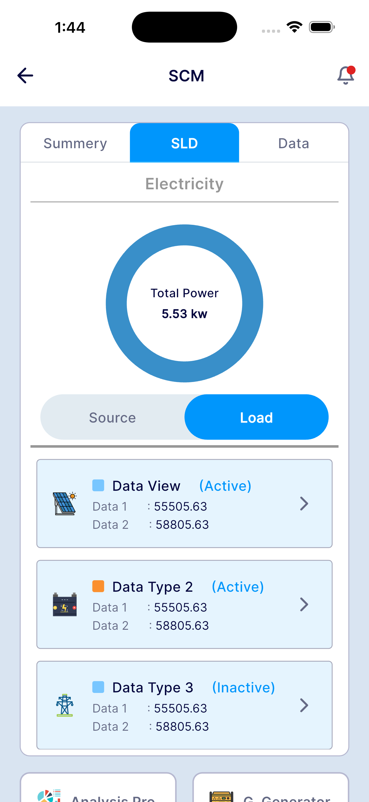
  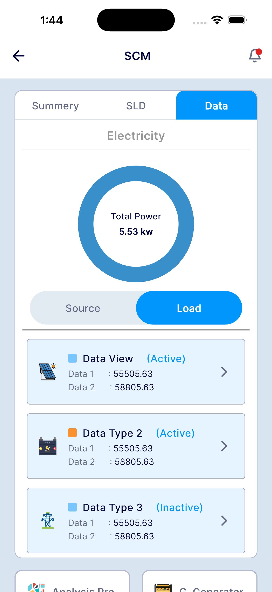
  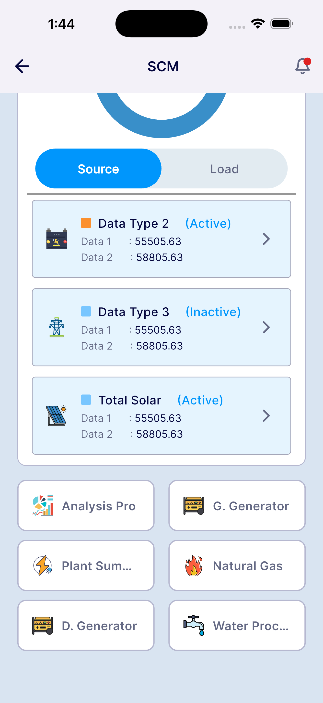
</p>

<p align="center">
  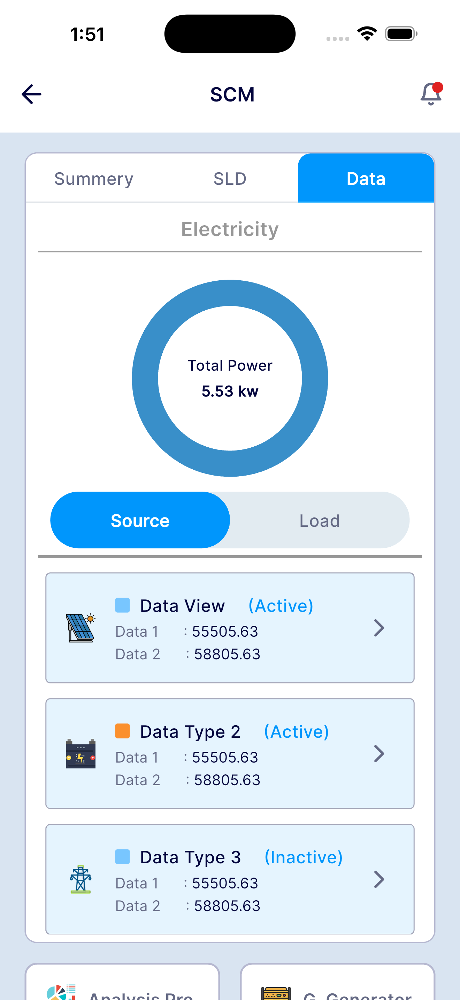
  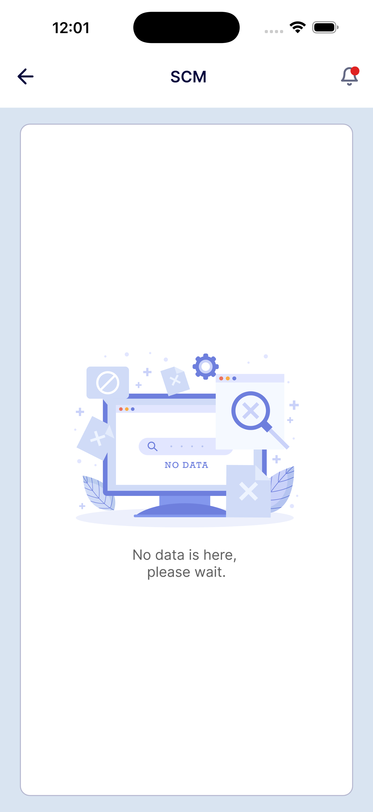
  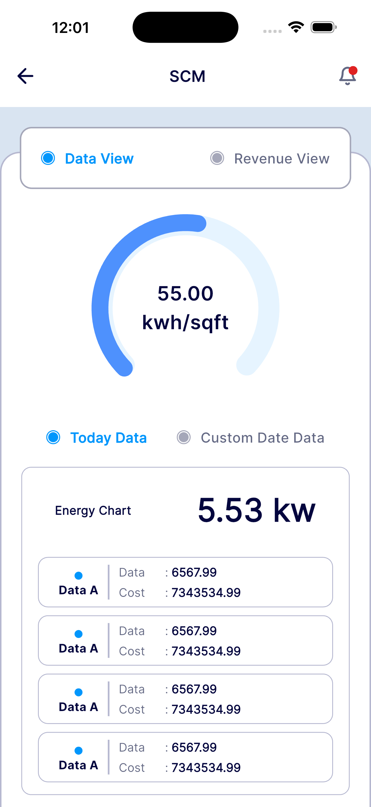
</p>

<p align="center">
  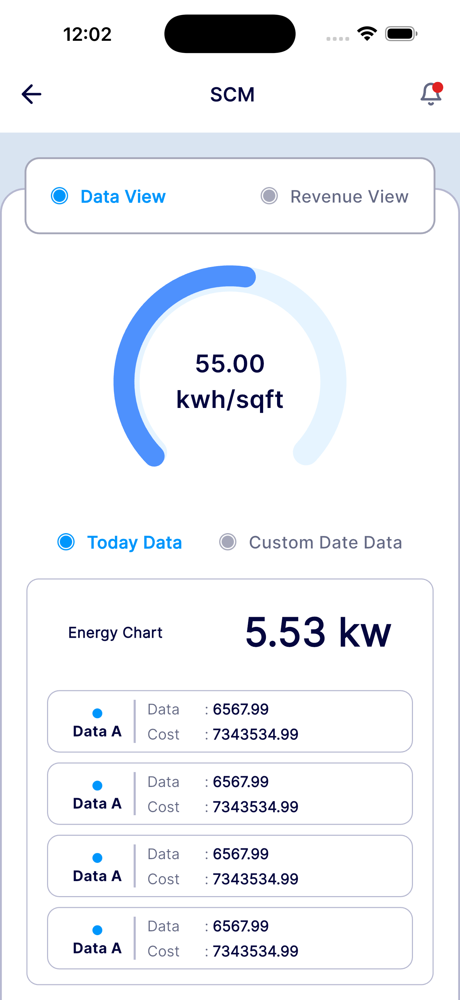
  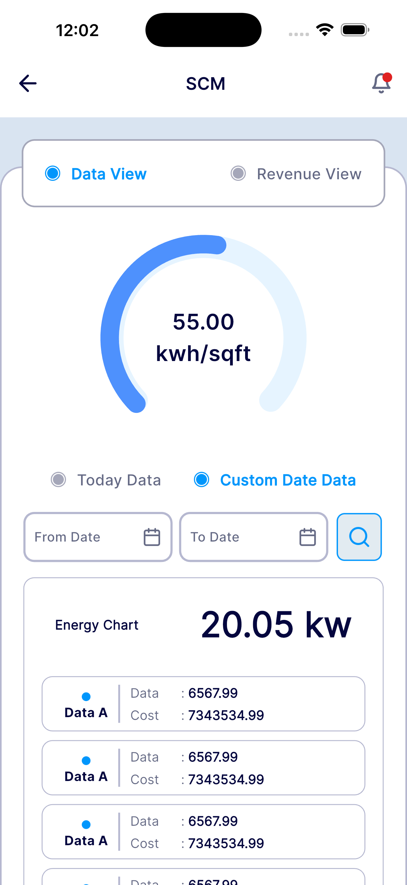
  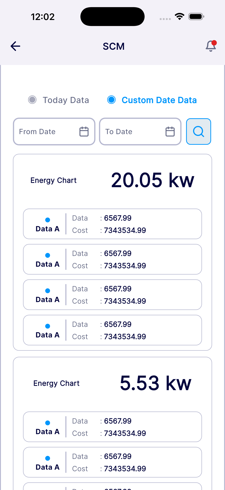
</p>

<p align="center">
  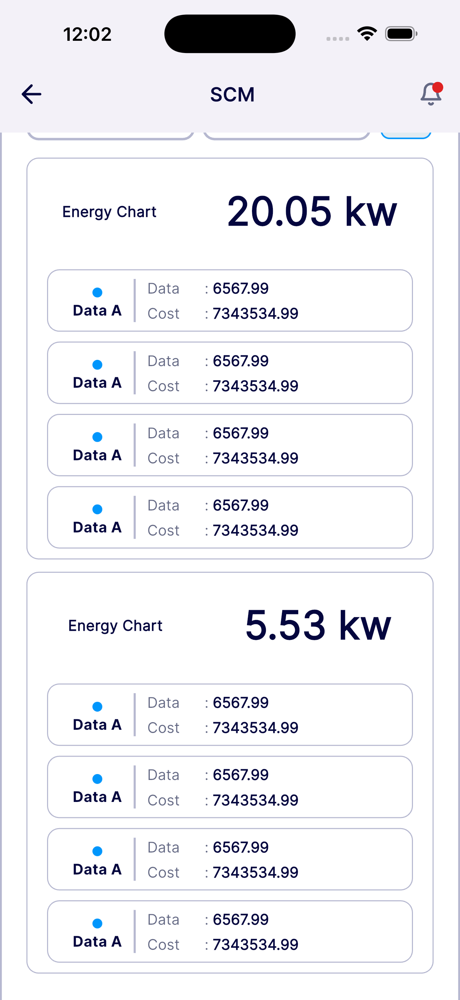
  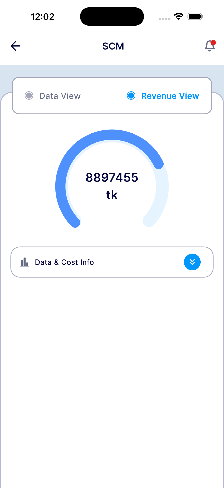
  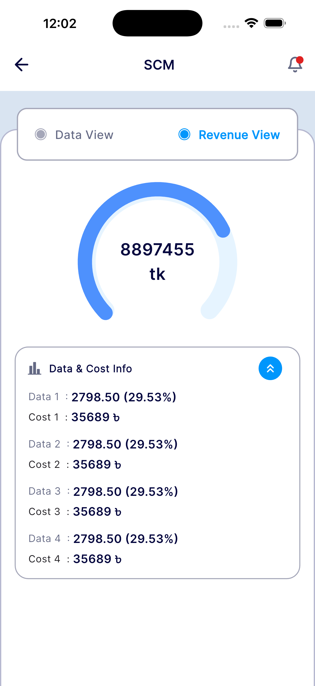
</p>


---

## System Requirements

- **Flutter SDK:** 3.13 or above  
- **Dart SDK:** 3.10.4 or above   
---

##  How to Download & Run

### Step 1: Clone the project from GitHub

```bash
git clone https://github.com/flutterdevrabby/scubeTask.git
```


### Step 2: Navigate to the project folder
```bash
cd scubeTask
```

### Step 3: Install dependencies
```bash
flutter pub get
```


### Step 4: Run the app
```bash
flutter run
```

